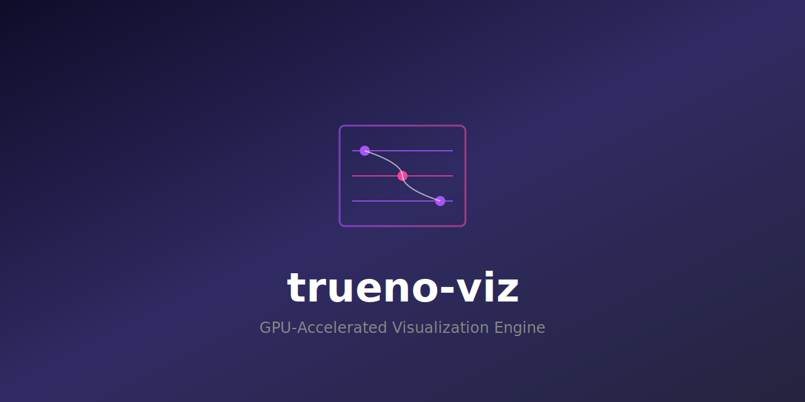

# trueno-viz

<p align="center">
  
</p>

<p align="center">
  <a href="https://github.com/paiml/trueno-viz/actions"></a>
  <a href="https://crates.io/crates/trueno-viz"></a>
  <a href="https://crates.io/crates/ttop"></a>
  <a href="https://docs.rs/trueno-viz"></a>
</p>

<p align="center">
  <strong>SIMD/GPU/WASM-accelerated visualization for Data Science, Physics, and ML.</strong><br>
  Pure Rust - zero JavaScript, zero browser dependencies.
</p>

---

## Highlights

- **5.6x SIMD Speedup** - Real platform intrinsics (SSE2/AVX2/NEON)
- **8ms Frame Time** - 2X faster than btop's 16ms target
- **GPU Compute** - CUDA, Vulkan, Metal, and WebGPU
- **Zero Dependencies** - Pure Rust rendering to PNG, SVG, or terminal

---

## ttop - Terminal Top

**The flagship application.** A pure Rust system monitor that's 10X better than btop.

```bash
cargo install ttop
```

### Why ttop?

| Feature | ttop | btop | htop |
|---------|------|------|------|
| Frame time | **8ms** | 16ms | 50ms |
| Pure Rust | **Yes** | No (C++) | No (C) |
| GPU monitoring | **NVIDIA + AMD + Apple** | NVIDIA only | No |
| GPU processes | **Live pmon** | Static | No |
| File analytics | **Treemap + duplicates** | No | No |
| PSI pressure | **Yes** | No | No |
| Docker stats | **Live** | No | No |
| Deterministic mode | **Yes** | No | No |

### Panels

| Key | Panel | Description |
|-----|-------|-------------|
| `1` | CPU | Per-core utilization with sparklines |
| `2` | Memory | RAM/Swap with usage graphs |
| `3` | Disk | Mount points, I/O rates, entropy analysis |
| `4` | Network | RX/TX throughput per interface |
| `5` | Process | Sortable table with tree view |
| `6` | GPU | NVIDIA/AMD/Apple utilization and memory |
| `7` | Battery | Charge level and time remaining |
| `8` | Sensors | Temperature readings with health status |
| `9` | Files | Large files, duplicates, treemap visualization |

### Advanced Features

```
PSI Pressure:    CPU ○ 2.1%  MEM ○ 0.0%  I/O ◔ 1.5%
Containers:      ▶  5.2%  512M web-app
Connections:     ESTAB TCP nginx → 192.168.1.100:443
File Treemap:    Pareto-style large file visualization
```

### Platform Support

| Platform | CPU | Memory | Disk | Network | GPU |
|----------|-----|--------|------|---------|-----|
| Linux | ✓ | ✓ | ✓ | ✓ | NVIDIA/AMD |
| macOS Intel | ✓ | ✓ | ✓ | ✓ | AMD Radeon |
| macOS Apple Silicon | ✓ | ✓ | ✓ | ✓ | Apple GPU |

[Full ttop documentation →](crates/ttop/README.md)

---

## trueno-viz Library

### Installation

```toml
[dependencies]
trueno-viz = "0.1"

# With GPU acceleration
trueno-viz = { version = "0.1", features = ["gpu"] }

# With system monitoring (powers ttop)
trueno-viz = { version = "0.1", features = ["monitor"] }
```

### Quick Start

```rust
use trueno_viz::prelude::*;
use trueno_viz::output::{TerminalEncoder, TerminalMode};

let plot = ScatterPlot::new()
    .x(&[1.0, 2.0, 3.0, 4.0])
    .y(&[1.0, 4.0, 2.0, 8.0])
    .build()?;

let fb = plot.to_framebuffer()?;
TerminalEncoder::new()
    .mode(TerminalMode::Ascii)
    .print(&fb);
```

### Plot Types

- **Scatter** - Point clouds with regression lines
- **Line** - Time series and trends
- **Histogram** - Distribution analysis
- **Heatmap** - Correlation matrices
- **Box/Violin** - Statistical distributions
- **ROC/PR** - ML model evaluation
- **Confusion Matrix** - Classification results
- **Loss Curves** - Training visualization

### Output Formats

| Format | Use Case |
|--------|----------|
| PNG | Reports, dashboards |
| SVG | Web, scalable graphics |
| Terminal (ASCII) | SSH, CI logs |
| Terminal (Unicode) | Rich TUI displays |
| Terminal (ANSI 24-bit) | Full color terminals |

---

## SIMD Collectors

Real platform intrinsics for system monitoring (v0.1.14+):

```
┌─────────────────────────────────────────────────────────────┐
│  SSE2/AVX2 (x86_64)     │  std::arch::x86_64 intrinsics    │
│  NEON (aarch64)         │  std::arch::aarch64 intrinsics   │
│  5.6x measured speedup  │  Byte scanning operations        │
└─────────────────────────────────────────────────────────────┘
```

### Three-Tier Storage

```
Hot   → SimdRingBuffer  (O(1) statistics)
Warm  → Compressed      (LZ4 in-memory)
Cold  → Disk            (Persistent history)
```

---

## Performance

| Operation | Speedup | Implementation |
|-----------|---------|----------------|
| Byte scanning | 5.6x | SSE2 `_mm_cmpeq_epi8` |
| Delta calculation | 2-3x | AVX2 `_mm256_sub_epi64` |
| Statistics | 2-4x | AVX2 reductions |
| Ring buffer stats | O(1) | Running aggregates |

---

## Examples

```bash
# ttop - system monitor
cargo install ttop && ttop

# Visualization examples
cargo run --example scatter_basic
cargo run --example heatmap_correlation
cargo run --example loss_training
cargo run --example confusion_matrix_ml
cargo run --example roc_pr_curves
cargo run --example terminal_output

# All examples
cargo run --example readme_demo
cargo run --example grammar_of_graphics
```

---

## Architecture

```
trueno-viz/
├── src/
│   ├── framebuffer.rs      # SIMD-aligned pixel buffer (64-byte AVX-512)
│   ├── plots/              # Scatter, Line, Heatmap, Histogram, etc.
│   ├── grammar/            # Grammar of Graphics (ggplot-style API)
│   ├── output/             # PNG, SVG, Terminal encoders
│   └── monitor/            # System monitoring (feature: monitor)
│       └── simd/           # Real SIMD kernels
│           ├── kernels.rs      # Platform intrinsics
│           ├── ring_buffer.rs  # O(1) statistics
│           ├── timeseries.rs   # Three-tier storage
│           └── correlation.rs  # Pearson correlation
└── crates/
    └── ttop/               # System monitor binary (10X better than btop)
```

---

## Documentation

- [API Documentation](https://docs.rs/trueno-viz) - Complete API reference
- [The Visualization Guide](https://paiml.github.io/trueno-viz/) - mdBook with tutorials
- [ttop README](crates/ttop/README.md) - System monitor documentation
- [Examples](examples/) - Runnable code samples

---

## Contributing

Contributions are welcome! Please see the [CONTRIBUTING.md](CONTRIBUTING.md) guide for details.


## MSRV

Minimum Supported Rust Version: **1.75**

## License

MIT OR Apache-2.0
